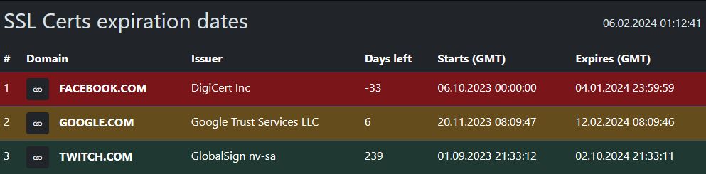

# Show SSL Certificate Expiration Dates
This is a quick-code script that displays SSL certificate information for the specified domains. The purpose of the script is to display information about domains' SSL certificates and show alerts about their expiration.

## Requirements
To run this script you need at least `PHP v8.1.x` with `php-curl` library.
